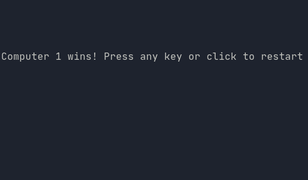

Play [CHOMP](https://en.wikipedia.org/wiki/Chomp) against a friend or computer. Or watch two computers play each other.

# Usage
```
usage: ./chomp [-12] r c
```
Start a game with `r` rows and `c` columns.

Optional flags
- `-1` sets player 1 to computer.
- `-2` sets player 2 to computer.

Click to make a move.

# Libraries
- ncurses
